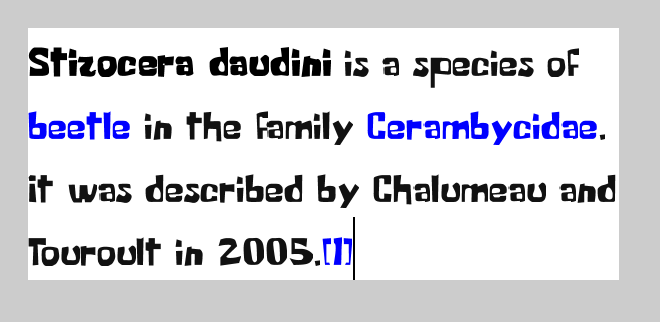

# LibGDX New Font API Experimentation



Directory layout:
- `harfbuzz/`: installed harfbuzz (currently macOS binaries)
- `harfbuzz-1.8.1/`: unmodified tarball release of harfbuzz (except for configuration)
- `caladea/`: testing fonts
- `build/`: [Wemi](https://github.com/Darkyenus/wemi) build script and data
- `src/`: Sources
	- [`com.badlogic.gdx.graphics.text`](src/main/java/com/badlogic/gdx/graphics/text): root of the new text API
- `jni/`: jni-gen temporary files (generated at build time)
- `libs/`: jni-gen outputs (generated at build time)

# How to compile and run
Configure and compile harfbuzz:
```bash
cd harfbuzz-1.8.1/

## Make prefix absolute
./configure --prefix=../harfbuzz --with-freetype=yes --with-glib=no --with-gobject=no --with-cairo=no --with-fontconfig=no --with-icu=no --with-ucdn=yes --with-graphite2=no --with-uniscribe=no --with-directwrite=no --with-coretext=no

make install
```

Run [demo](src/main/java/com/darkyen/libgdx/HarfBuzzTest.java):
```bash
./wemi run
```

# API Structure
Because each text backend has different requirements on font format and glyph layout,
and because some text backends need some state and configuration, new entry-point interface has been introduced:
[`FontSystem`](src/main/java/com/badlogic/gdx/graphics/text/FontSystem.java).
Each font system/backend then implements this interface, and exposes its capabilities through it.
Users are expected to work directly with these implementations.
This repository creates two implementations, [`BitmapFontSystem`](src/main/java/com/badlogic/gdx/graphics/text/bitmap/BitmapFontSystem.java)
and [`HBFontSystem`](src/main/java/com/badlogic/gdx/graphics/text/harfbuzz/HBFontSystem.java), which expose two backends,
**Bitmap** and **HarfBuzz**.

## General API functionality
Each font backend uses some common API classes/interfaces. They are designed to mimic current/*old* API as closely as possible,
to ease transition for users and to allow some code reuse.

- [`Font`](src/main/java/com/badlogic/gdx/graphics/text/Font.java): mostly opaque immutable object. 
	Users are not expected to need any of its functionality. Few methods it has are only to be used by `GlyphLayout`,
	but they may end up hidden as well, because `GlyphLayout` must be specifically tailored to the specific `Font` implementation.
- [`GlyphLayout`](src/main/java/com/badlogic/gdx/graphics/text/GlyphLayout.java): performs the layout of the text itself and stores the result.
	Laid out text is supplied through `LayoutText` and the `GlyphLayout` stores only the last laid out text.
	It also allows some introspection about the text, such as its dimensions.
	(*More thorough introspection for text editing UI is planned, but not yet implemented.*)
- [`FontRenderCache`](src/main/java/com/badlogic/gdx/graphics/text/FontRenderCache.java): Creates, stores and allows
	some simple manipulation of `Batch` compatible, ready to draw, glyphs. Rendering always comes through this class,
	because it also reorders draw-calls to minimize texture switching.
	This is all like in the current/*old* API. Since fonts no longer support arbitrary scaling or Y flipping (all is now Y-up, as it should be),
	these transformations should now be done here.
- [`LayoutText`](src/main/java/com/badlogic/gdx/graphics/text/LayoutText.java): similar to `AnnotatedString` of other libraries,
	creates a binding between text, fonts and colors. Essentially describes, which characters should be drawn in which font and in which color.
	This replaces old markup system, as dealing with characters inline with markup added a lot of complexity and did not really work when the text
	was to be edited. Markup to `LayoutText` converter will still be provided, as it is a convenient and efficient
	way to describe text properties.
	- It also holds info about tab-stop positions

Example usage in pseudocode:
```

LayoutText text = new LayoutText();
fillTextAndFontData(text, myFont, myColors);

GlyphLayout layout = fontSystem.createGlyphLayout();
layout.layoutText(text);

FontRenderCache cache = new FontRenderCache();
cache.addGlyphs(layout, textX, textY);

batch.begin();
cache.draw(batch);
batch.end();
```

This is admittedly a bit wordy, so convenience paths will be provided, for more fluent usage, like in the current/*old* system.

## Font systems
All systems (should, both provided do) support bidirectional text (through java.text.Bidi classes),
multiple fonts and colors per text, customizable tab stops, shaping to fit width and height (in units or lines),
and ellipsis truncation.

- **Bitmap**
	- Simple, Java only backend for static `.fnt` files
	- Assumes that each codepoint corresponds to exactly one glyph, which is not true for all unicode characters,
	but `.fnt` files don't support anything more complex. Therefore it supports Hebrew (simple RTL),
	but not Arabic (RTL, complex glyph variants).
	- Since it is Java only, it works on all backends, including GWT. Note that GWT does not support `java.text.Bidi`,
	so the support for bidirectional text will be, most likely, missing, and only single-direction text (with user-defined direction) will be possible.
- **HarfBuzz**
	- Uses HarfBuzz + FreeType to generate glyph textures at runtime from `.ttf` or `.otf` fonts
	 (though pre-rendered glyphs will be probably also possible)
	- HarfBuzz handles complex grapheme shaping, including ligatures etc., so all world's scripts should be available
	- Since it relies on native libraries, it will be supplied as an extension, which should be available to all libGDX backends, except GWT

# What is done and what to do

### Done
- General API
- BitmapFontSystem
	- Loading
	- Multiple font & color shaping
	- Line wrapping & dimension limits
	- Ellipsis
	- Tab stops
	- Horizontal align
	- Bidirectional text, according to BiDi algorithm, including character mirroring
- HarfBuzz bindings
- Text editing introspection
	- "where should caret go when it is at this index?"
	- "what character did I press when I clicked here?"
	- "how it should move when I press LEFT/RIGHT/UP/DOWN arrow? And which characters to delete on DELETE or BACKSPACE?"
- Markup to `LayoutText` converter

### ToDo
- BitmapFontSystem
	- Optimize for heavily wrapped text
	- Fallback fonts
- Text editing introspection
	- "how should I render selection?"
- API shortcuts for everyday use, where not all features are needed
- HBFontSystem
	- everything
